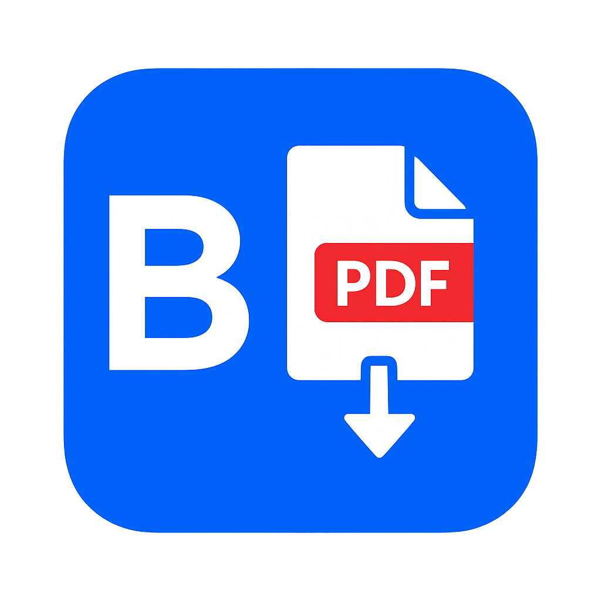

  

# Behance2PDF

**Effortlessly save Behance projects as high-quality PDFs or download all project images in one click.**

Behance2PDF is a production-grade Chrome extension designed for creative professionals, students, and design enthusiasts. With a single click, you can export any Behance project as a beautifully formatted PDF or bulk-download all images in their highest available resolution. Built for reliability, speed, and privacy, Behance2PDF streamlines your creative workflow and ensures you always have access to your favorite projects—online or offline.

---

## 🚀 Features

- **One-Click PDF Export:** Instantly save Behance projects as high-quality PDFs, preserving original layouts and image fidelity.
- **Bulk Image Download:** Download all project images as a ZIP archive, with smart, meaningful file naming.
- **High-Resolution Assets:** Always get the best quality images available from each project.
- **Seamless Integration:** Non-intrusive UI that appears only on Behance project pages.
- **Robust Error Handling:** Clear feedback and graceful recovery from network or page issues.
- **Privacy-First:** No data collection, tracking, or external analytics—your browsing stays yours.

---

## 🛠 Installation

1. **Get Behance2PDF from the [Chrome Web Store](https://chrome.google.com/webstore/detail/behance2pdf/)**
2. Pin the extension for quick access (optional)
3. Visit any Behance project page and start saving!

---

## 📖 Usage

1. Navigate to a Behance project on [behance.net](https://www.behance.net/)
2. Click the floating **Save as PDF** or **Download Images** button
3. Your files will be automatically downloaded with project-based names

---

## 💬 Feedback & Support

We value your feedback! If you have feature requests, bug reports, or ideas for improvement, please:
- [Open an issue](https://github.com/nerdynikhil/Behance2PDF/issues)
- Leave a review on the [Chrome Web Store](https://chrome.google.com/webstore/detail/behance2pdf/)

---

## 👨‍💻 Credits

Made with ❤️ by [nerdynikhil](https://github.com/nerdynikhil). Behance2PDF is open source and built for the creative community.

---

## 📄 License

This project is licensed under the MIT License.
